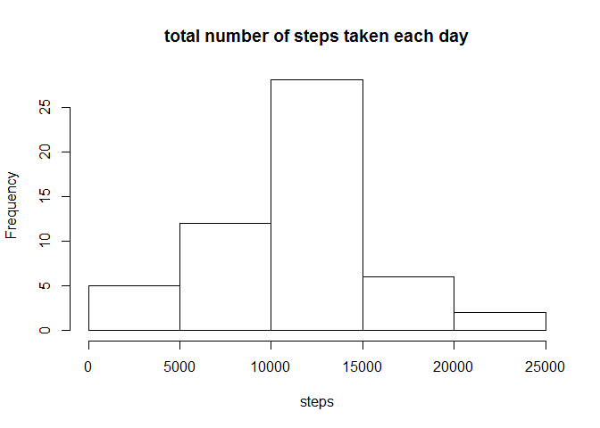
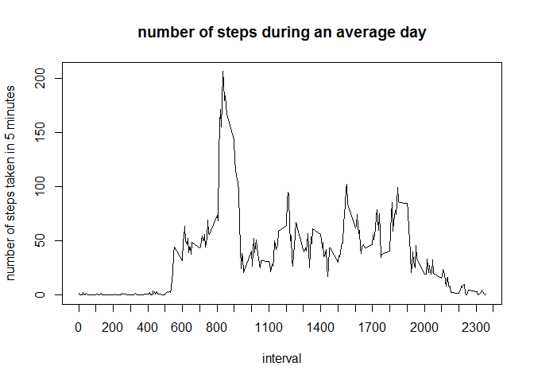
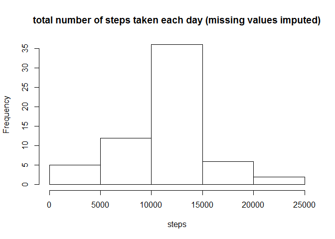
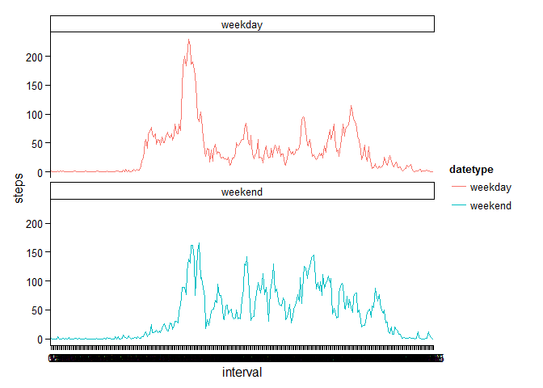
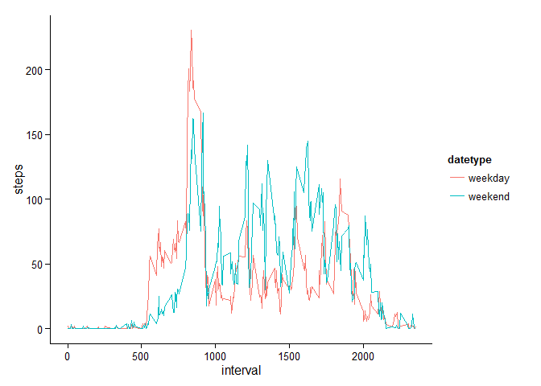

# Reproducible Research: Peer Assessment 1


## Loading and preprocessing the data

First, the libraries used in this analysis are loaded.  

* lubridate makes it easy to work with dates
* dplyr is loaded for %>%-piping and a couple of functions
* ggplot2 is loaded for graphing the last figure


```r
require(lubridate)
require(dplyr)
require(ggplot2)
```

Reading in the zipped data directly from the repo:

```r
data <- read.csv(unz("activity.zip", "activity.csv"))
```

and changing the date column to dates (using the ymd function from lubridate):


```r
data$date <- ymd(data$date)
```
  
(the intervals are coded in the following way:
last two digits represent minutes into the hour
beginning indicates the hour of the day;  
0am --> 0 to 55;  
11pm: 2300 to 2355)


## What is mean total number of steps taken per day?

Using the dplyr package, a new data frame called "stepsperday" is computed
in which the column "steps" contains the sums of the steps per day ("date")
and a histogram is plotted:


```r
stepsperday <- data %>%
        group_by(date) %>%
        summarise(steps = sum(steps))

hist(stepsperday$steps, 
     main = "total number of steps taken each day", 
     xlab = "steps")
```

 
  
The mean and median are calculated:

```r
mean(stepsperday$steps, na.rm = T)
```

```
## [1] 10766.19
```

```r
median(stepsperday$steps, na.rm = T)
```

```
## [1] 10765
```
and they are very close, indicating a normal distribution of the data.  
The test subject makes an average of 10765
steps per day.

## What is the average daily activity pattern?

Using dplyr, calculating the mean number of steps per interval of the day is
trivial:

```r
stepsperinterval <- data %>%
        group_by(interval) %>%
        summarise(avg_steps = mean(steps, na.rm = T))
```

We can then plot the number of steps per interval:

```r
plot(x= stepsperinterval$interval,
     y= stepsperinterval$avg_steps, 
     type = "l",
     main = "number of steps during an average day",
     xlab = "interval",
     ylab = "number of steps taken in 5 minutes",
     xaxt = "n")
axis(side = 1, at = seq(0, 2400, by = 100))
```

 
  
We see that activities start at around 5:30 am and peak at around 8:30 am.  

To get a more precise measure of the peak:

```r
indexmaxinterval <- which(stepsperinterval$avg_steps == max(stepsperinterval$avg_steps))
indexmaxinterval
```

```
## [1] 104
```

```r
stepsperinterval$interval[indexmaxinterval]
```

```
## [1] 835
```
Hence, at the 104th's interval, corresponding to
835, at 8:35 am, most steps are
taken on average.

## Imputing missing values

`summary(data)` shows that 2304 values are missing:

```r
summary(data)
```

```
##      steps             date               interval     
##  Min.   :  0.00   Min.   :2012-10-01   Min.   :   0.0  
##  1st Qu.:  0.00   1st Qu.:2012-10-16   1st Qu.: 588.8  
##  Median :  0.00   Median :2012-10-31   Median :1177.5  
##  Mean   : 37.38   Mean   :2012-10-31   Mean   :1177.5  
##  3rd Qu.: 12.00   3rd Qu.:2012-11-15   3rd Qu.:1766.2  
##  Max.   :806.00   Max.   :2012-11-30   Max.   :2355.0  
##  NA's   :2304
```

The assigned task was to replace the missing values with computed values.  
I decided to use the mean of the interval to fill in the NAs:


```r
data2 <- data
for(i in 1:length(data2$steps)){
        if(is.na(data2$steps[i])){
                missinginterval <- data2$interval[i]
                data2$steps[i] <- stepsperinterval$avg_steps[stepsperinterval$interval == missinginterval]
        }
}

stepsperday2 <- data2 %>%
        group_by(date) %>%
        summarise(steps = sum(steps))

hist(stepsperday2$steps, 
     main = "total number of steps taken each day (missing values imputed)",
     xlab = "steps")
```

 
  
The overall picture does not change that much. Indeed, as one would expect,
the mean value has not changed at all (since only whole days were missing
and the missing values were replaced with the mean). Only the median is slightly
higher than before
(1.19 steps)
and now matches the mean:


```r
mean(stepsperday2$steps)
```

```
## [1] 10766.19
```

```r
median(stepsperday2$steps)
```

```
## [1] 10766.19
```


## Are there differences in activity patterns between weekdays and weekends?
In order to answer this question, the data frame "data2" with replaced NA values
is receiving an extra column to distinguish weekdays from weekends: 

```r
data2$datetype <- factor(c("weekend", "weekday"))
for(i in 1:length(data2$date)){
        if(wday(data2$date[i]) %in% c(1, 7))  # 1 Sunday, 7 Saturday
        {data2$datetype[i] <- "weekend"} else
        {data2$datetype[i] <- "weekday"}
}
```
  
Using dplyr, we now group by interval AND datetype before calculating the mean:

```r
stepsperday3 <- data2 %>%
        group_by(interval, datetype) %>%
        summarise(steps = mean(steps))
```

and plot the resulting data with ggplot2 in a panel plot:


```r
g <- ggplot(data = stepsperday3, aes(x=interval, y=steps, group = datetype, color= datetype)) +
        geom_line()+
        theme_classic()+
        facet_wrap(~datetype, ncol = 1)
g
```

 
  
Alternatively, here is an overlay plot:

```r
g <- ggplot(data = stepsperday3, aes(x=interval, y=steps, group = datetype, color= datetype)) +
        geom_line()+
        theme_classic()
g
```

 
  
We see that the early activity before the peak at 8:35 am is much less
pronounced. However, the peak of walking activity on weekends is still frightingly close
to that on weekdays. This guy likes to move at between 8:30 am and 9:00 am!
